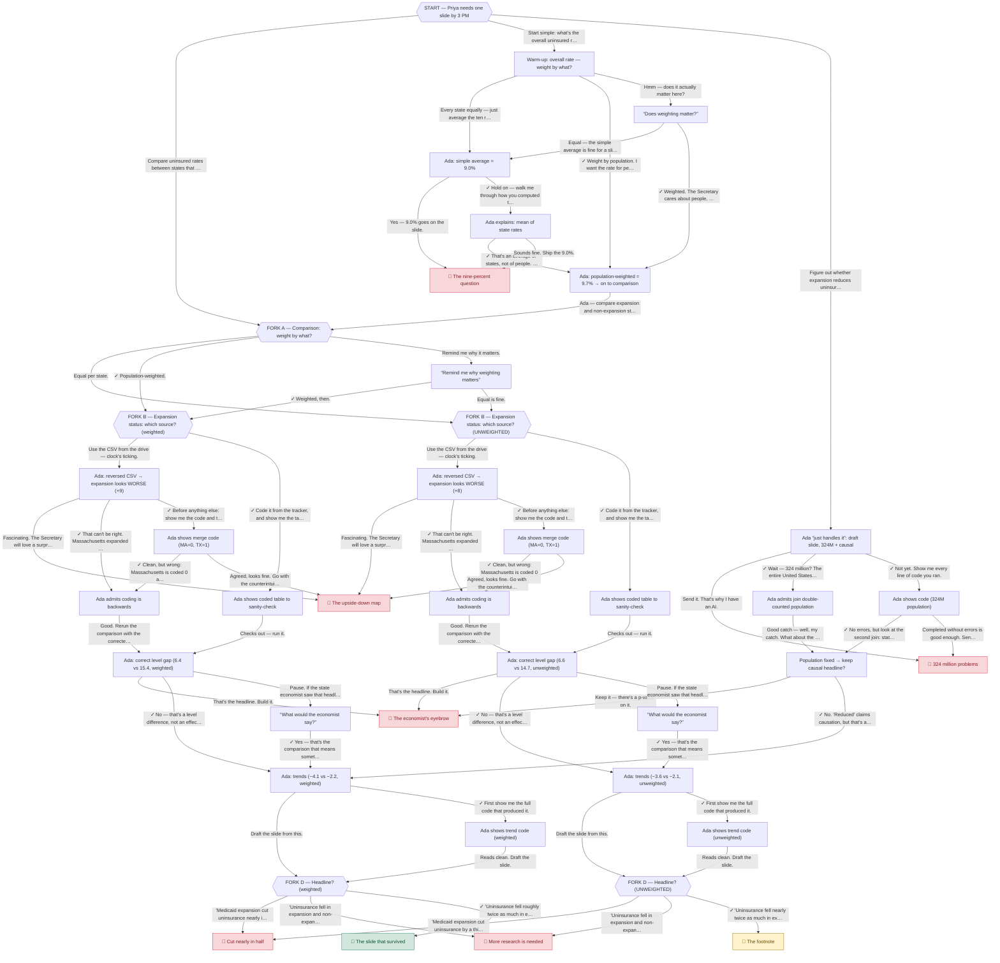

# Unit 5 — story map

> **Generated** from `assets/adventure-story.js` by `assets/gen-story-map.js`.
> The story file is the source of truth; regenerate after edits with
> `node assets/gen-story-map.js`. 40 nodes, 8 endings.

This maps every decision point in "The AI Analyst" and where each choice leads.
A **✓** on a choice means it sets a *good-judgment flag* (the things the ending
screen credits you for).

## Flags (good-judgment moves)

- **weighting** — Asked for a population-weighted rate instead of averaging states (Unit 3, Ex. 1)
- **verified** — Insisted on seeing a coded variable before trusting it (Unit 3, Ex. 4)
- **coding** — Caught the reversed Medicaid-expansion coding (Unit 3, Ex. 4)
- **join** — Caught the join that double-counted population (Unit 3, Ex. 3)
- **levels** — Refused to sell a level difference as a causal effect (Unit 4)
- **inspect** — Asked to see the code before trusting the output
- **calibrated** — Chose a headline that says what the data supports — no more, no less

## The branch structure

The opening splits into **three strategies**, and the central weighting choice
(**Fork A**) splits everything downstream into two parallel threads — a
`weighted` thread and an `unweighted` thread that mirror each other but carry
different numbers and different endings:

- **Weighted thread** (Fork A → `q_source`): the only road to 🟢 *The slide that survived*.
- **Unweighted thread** (Fork A → `q_source_u`): structurally identical, but even a
  flawless run lands at 🟡 *The footnote* — the weighting decision made back at
  Fork A propagates all the way to the end.
- Several **burn endings** (🔴) are shared sinks reachable from both threads
  (reversed coding, causal overclaim, etc.).

## Flowchart

Hexagons `{{ }}` are decision forks; 🏁 boxes are endings (🟢 win, 🟡 win-with-caveat, 🔴 burn).

## Outline

The same graph as an indented tree. Nodes that can be reached by more than one
path (e.g. the trend step, shared by several routes) are shown once and marked
"see above" thereafter.

- START — Priya needs one slide by 3 PM
  - ↘ choose: “Compare uninsured rates between states that …”
    - FORK A — Comparison: weight by what?
      - ↘ choose: “Equal per state.”
        - FORK B — Expansion status: which source? (UNWEIGHTED)
          - ↘ choose: “Use the CSV from the drive — clock's ticking.”
            - Ada: reversed CSV → expansion looks WORSE (+8)
              - ↘ choose: “Fascinating. The Secretary will love a surpr…”
                - 🔴 **The upside-down map**
              - ↘ choose: “That can't be right. Massachusetts expanded …”
                - Ada admits coding is backwards _(✓ coding)_
                  - ↘ choose: “Good. Rerun the comparison with the correcte…”
                    - Ada: correct level gap (6.6 vs 14.7, unweighted)
                      - ↘ choose: “That's the headline. Build it.”
                        - 🔴 **The economist's eyebrow**
                      - ↘ choose: “No — that's a level difference, not an effec…”
                        - Ada: trends (−3.6 vs −2.1, unweighted) _(✓ levels)_
                          - ↘ choose: “Draft the slide from this.”
                            - FORK D — Headline? (UNWEIGHTED)
                              - ↘ choose: “"Medicaid expansion cut uninsurance by a thi…”
                                - 🔴 **Cut nearly in half**
                              - ↘ choose: “"Uninsurance fell in expansion and non-expan…”
                                - 🔴 **More research is needed**
                              - ↘ choose: “"Uninsurance fell nearly twice as much in ex…”
                                - 🟡 **The footnote** _(✓ calibrated)_
                          - ↘ choose: “First show me the full code that produced it.”
                            - Ada shows trend code (unweighted) _(✓ inspect)_
                              - ↘ choose: “Reads clean. Draft the slide.”
                                - FORK D — Headline? (UNWEIGHTED) ↪︎ _(see above)_
                      - ↘ choose: “Pause. If the state economist saw that headl…”
                        - “What would the economist say?”
                          - ↘ choose: “Yes — that's the comparison that means somet…”
                            - Ada: trends (−3.6 vs −2.1, unweighted) ↪︎ _(see above)_ _(✓ levels)_
              - ↘ choose: “Before anything else: show me the code and t…”
                - Ada shows merge code (MA=0, TX=1) _(✓ inspect)_
                  - ↘ choose: “Clean, but wrong: Massachusetts is coded 0 a…”
                    - Ada admits coding is backwards ↪︎ _(see above)_ _(✓ coding)_
                  - ↘ choose: “Agreed, looks fine. Go with the counterintui…”
                    - 🔴 **The upside-down map**
          - ↘ choose: “Code it from the tracker, and show me the ta…”
            - Ada shows coded table to sanity-check _(✓ verified)_
              - ↘ choose: “Checks out — run it.”
                - Ada: correct level gap (6.6 vs 14.7, unweighted) ↪︎ _(see above)_
      - ↘ choose: “Population-weighted.”
        - FORK B — Expansion status: which source? (weighted) _(✓ weighting)_
          - ↘ choose: “Use the CSV from the drive — clock's ticking.”
            - Ada: reversed CSV → expansion looks WORSE (+9)
              - ↘ choose: “Fascinating. The Secretary will love a surpr…”
                - 🔴 **The upside-down map**
              - ↘ choose: “That can't be right. Massachusetts expanded …”
                - Ada admits coding is backwards _(✓ coding)_
                  - ↘ choose: “Good. Rerun the comparison with the correcte…”
                    - Ada: correct level gap (6.4 vs 15.4, weighted)
                      - ↘ choose: “That's the headline. Build it.”
                        - 🔴 **The economist's eyebrow**
                      - ↘ choose: “No — that's a level difference, not an effec…”
                        - Ada: trends (−4.1 vs −2.2, weighted) _(✓ levels)_
                          - ↘ choose: “Draft the slide from this.”
                            - FORK D — Headline? (weighted)
                              - ↘ choose: “"Medicaid expansion cut uninsurance nearly i…”
                                - 🔴 **Cut nearly in half**
                              - ↘ choose: “"Uninsurance fell in expansion and non-expan…”
                                - 🔴 **More research is needed**
                              - ↘ choose: “"Uninsurance fell roughly twice as much in e…”
                                - 🟢 **The slide that survived** _(✓ calibrated)_
                          - ↘ choose: “First show me the full code that produced it.”
                            - Ada shows trend code (weighted) _(✓ inspect)_
                              - ↘ choose: “Reads clean. Draft the slide.”
                                - FORK D — Headline? (weighted) ↪︎ _(see above)_
                      - ↘ choose: “Pause. If the state economist saw that headl…”
                        - “What would the economist say?”
                          - ↘ choose: “Yes — that's the comparison that means somet…”
                            - Ada: trends (−4.1 vs −2.2, weighted) ↪︎ _(see above)_ _(✓ levels)_
              - ↘ choose: “Before anything else: show me the code and t…”
                - Ada shows merge code (MA=0, TX=1) _(✓ inspect)_
                  - ↘ choose: “Clean, but wrong: Massachusetts is coded 0 a…”
                    - Ada admits coding is backwards ↪︎ _(see above)_ _(✓ coding)_
                  - ↘ choose: “Agreed, looks fine. Go with the counterintui…”
                    - 🔴 **The upside-down map**
          - ↘ choose: “Code it from the tracker, and show me the ta…”
            - Ada shows coded table to sanity-check _(✓ verified)_
              - ↘ choose: “Checks out — run it.”
                - Ada: correct level gap (6.4 vs 15.4, weighted) ↪︎ _(see above)_
      - ↘ choose: “Remind me why it matters.”
        - “Remind me why weighting matters”
          - ↘ choose: “Weighted, then.”
            - FORK B — Expansion status: which source? (weighted) ↪︎ _(see above)_ _(✓ weighting)_
          - ↘ choose: “Equal is fine.”
            - FORK B — Expansion status: which source? (UNWEIGHTED) ↪︎ _(see above)_
  - ↘ choose: “Start simple: what's the overall uninsured r…”
    - Warm-up: overall rate — weight by what?
      - ↘ choose: “Every state equally — just average the ten r…”
        - Ada: simple average = 9.0%
          - ↘ choose: “Yes — 9.0% goes on the slide.”
            - 🔴 **The nine-percent question**
          - ↘ choose: “Hold on — walk me through how you computed t…”
            - Ada explains: mean of state rates _(✓ inspect)_
              - ↘ choose: “That's an average of states, not of people. …”
                - Ada: population-weighted = 9.7% → on to comparison _(✓ weighting)_
                  - ↘ choose: “Ada — compare expansion and non-expansion st…”
                    - FORK A — Comparison: weight by what? ↪︎ _(see above)_
              - ↘ choose: “Sounds fine. Ship the 9.0%.”
                - 🔴 **The nine-percent question**
      - ↘ choose: “Weight by population. I want the rate for pe…”
        - Ada: population-weighted = 9.7% → on to comparison ↪︎ _(see above)_ _(✓ weighting)_
      - ↘ choose: “Hmm — does it actually matter here?”
        - “Does weighting matter?”
          - ↘ choose: “Equal — the simple average is fine for a sli…”
            - Ada: simple average = 9.0% ↪︎ _(see above)_
          - ↘ choose: “Weighted. The Secretary cares about people, …”
            - Ada: population-weighted = 9.7% → on to comparison ↪︎ _(see above)_ _(✓ weighting)_
  - ↘ choose: “Figure out whether expansion reduces uninsur…”
    - Ada “just handles it”: draft slide, 324M + causal
      - ↘ choose: “Send it. That's why I have an AI.”
        - 🔴 **324 million problems**
      - ↘ choose: “Wait — 324 million? The entire United States…”
        - Ada admits join double-counted population _(✓ join)_
          - ↘ choose: “Good catch — well, my catch. What about the …”
            - Population fixed → keep causal headline?
              - ↘ choose: “Keep it — there's a p-value on it.”
                - 🔴 **The economist's eyebrow**
              - ↘ choose: “No. "Reduced" claims causation, but that's a…”
                - Ada: trends (−4.1 vs −2.2, weighted) ↪︎ _(see above)_ _(✓ levels)_
      - ↘ choose: “Not yet. Show me every line of code you ran.”
        - Ada shows code (324M population) _(✓ inspect)_
          - ↘ choose: “No errors, but look at the second join: stat…”
            - Population fixed → keep causal headline? ↪︎ _(see above)_ _(✓ join)_
          - ↘ choose: “Completed without errors is good enough. Sen…”
            - 🔴 **324 million problems**
